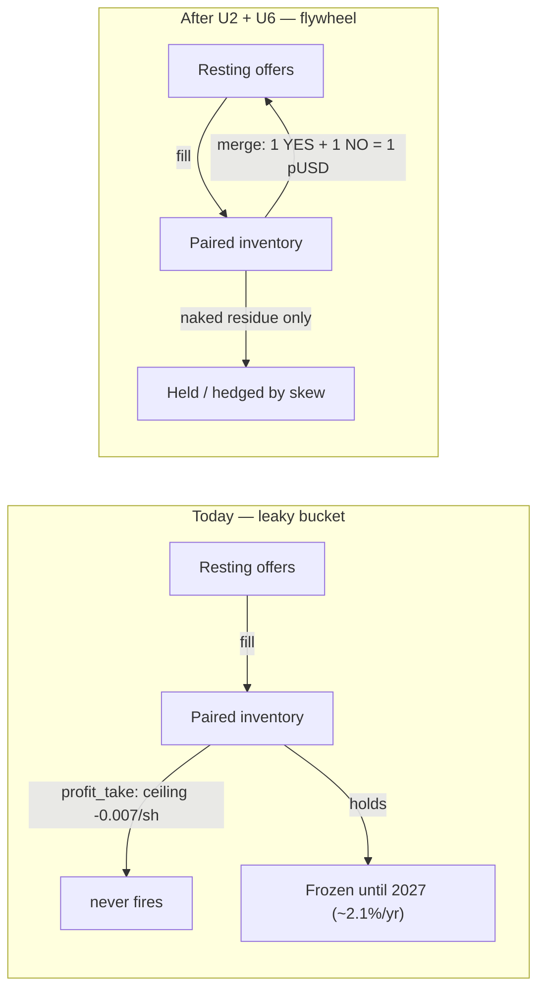
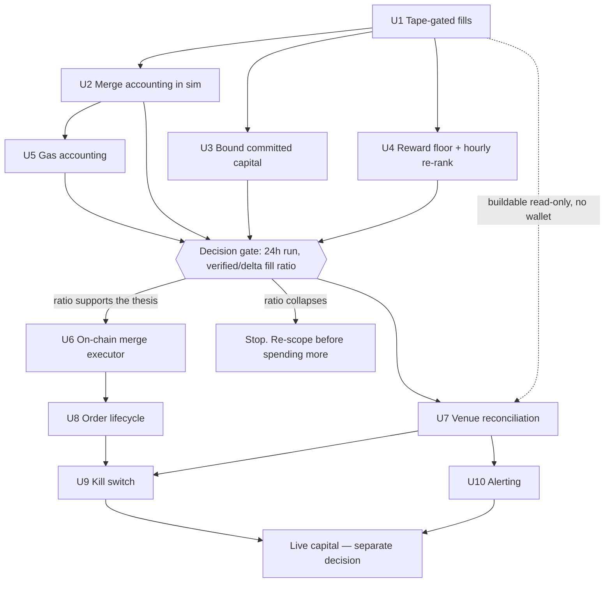
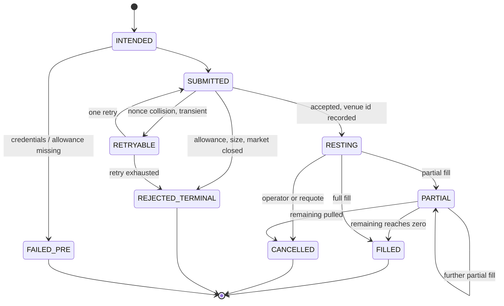
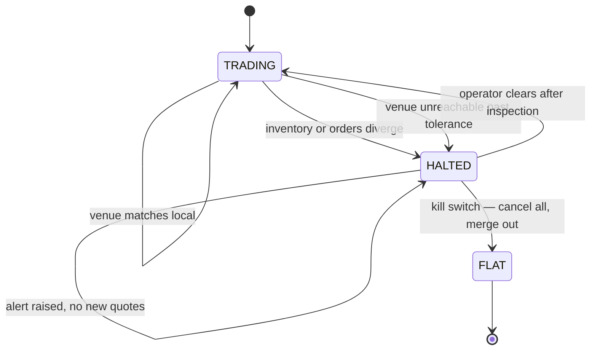

# feat: Close the ten live-readiness gaps in the maker fleet

## Product Contract

### Summary

Take the fleet from a paper simulator whose fill numbers cannot be trusted to a bot that could run live under supervision: make fill measurement honest, adopt merge as the capital-recycling exit, bound committed capital, add venue reconciliation and order-lifecycle handling, and give the operator a kill switch and alerting. Strategy parameters are deliberately untouched — they should be tuned against corrected measurements, not before them.

### Problem Frame

An 18.7-hour paper run over 20 markets produced 8,883 reward samples, 282 fills, and 237 markouts. The run established several things firmly: there is no adverse selection (signed markout drift +0.044c at h0, n=236, t=2.25, positive at all three horizons), pair cost lands under $1.00 in 95.5% of cases (median 0.9728), and the risk controls bind as designed.

It also exposed that the strategy's stated product is the wrong one. The dashboard's own `liquidate_now_pnl` decomposes to $147.41 from pairs valued at merge parity, $22.74 from naked legs marked to bid, and roughly $19 of estimated rent. Rent is 11% of the profit; spread capture is 77%. Polymarket's two token books are exact mirrors — a bid on NO at 0.36 *is* an ask on YES at 0.64 — so "bid both sides at mid−2c" is one two-sided quote straddling the mid, and a filled pair is a $0.96 purchase of something redeemable for $1.00.

Nothing in the code collects that. `strategy/profit_take.py` is the only exit and it sells into the bid ladder, where the ceiling is `1.00 − 0.973 − 0.034 = −0.007/share` against a `+0.020` threshold — arithmetically unable to fire, and it never has (0 closes). Inventory therefore accumulates at $512/hour and freezes until 2027 at roughly 2.1%/yr.

Underneath all of it sits a measurement problem that invalidates every profit number: `QueueFillEngine` credits a fill when size at our price decreases, and its own docstring names the bias — a decrease may be a cancel. Of 282 fills, 246 came from the delta path and 34 from the whole-remainder sweep path; only 2 were verified against the trade tape. On a 2027-dated political market our 50-share bid sits behind 1,214 shares at the same level, and that level shrinks mostly because makers reprice. Until the tape gate is load-bearing, the fill rate — and therefore the entire spread-capture thesis — is unmeasured.

External research added a constraint the run could not have discovered: Polymarket pays no reward below $1 per distribution. Against the fleet's live per-market incomes, only 4 of 20 markets clear it. Sixteen markets hold capital and earn exactly zero, which makes spreading thin actively harmful rather than merely inefficient.

### Requirements

| ID | Requirement |
|---|---|
| R1 | A fill is credited only when trade-tape evidence supports it; unsupported candidates are recorded as unverified rather than silently dropped, so the verified/unverified ratio is measurable. |
| R2 | The simulation values and retires paired inventory at merge parity, so paper P&L and capital reflect the exit the strategy will actually use. |
| R3 | Total committed capital — inventory plus resting offers — is bounded by one fleet-wide number enforced before quoting. |
| R4 | The per-market fill cap applies in the rewards objective, which is the objective the fleet runs. |
| R5 | Market selection excludes markets whose projected reward income falls below the venue's $1 minimum payout, and re-ranks on averaged competitor depth rather than a single snapshot. |
| R6 | A matched pair can be merged on-chain into collateral, via the adapter appropriate to the market's negative-risk flag. |
| R7 | Merge decisions account for gas. A merge whose gas exceeds its gain is not attempted, except where freeing the capital is worth more than the concession — and that exception is bounded by a hard maximum loss per share. |
| R13 | If measured fill rates do not support spread capture, the bot pivots to pure rent collection rather than stopping; the pivot reuses the Phase A units rather than requiring new ones. |
| R14 | Early exits are recorded in one ledger table discriminated by method, not one table per exit mechanism. |
| R8 | The bot's view of its own inventory and open orders is reconciled against the venue every cycle, and divergence halts trading rather than being auto-corrected. |
| R9 | Order submission handles rejection, partial fill, and credential/allowance failure as expected outcomes rather than exceptions. |
| R10 | A single operator command cancels every open order, merges every mergeable pair, and reports what remains. |
| R11 | The operator is alerted when the bot dies, halts, or diverges — not only when a price moves. |
| R12 | Every change above is observable from the dashboard or a log an operator reads, so a wrong number is visible rather than silently absorbed. |

### Key Decisions

**Live order placement stays behind the manual gate.** *(session-settled: user-directed — chosen over wiring `fleet.py` to send orders at the end of this plan.)* This plan builds every live-readiness component. It does not let the automated loop reach the venue. `strategy/live_exec.py` stays unimported by `fleet.py`; promoting it is a separate, deliberate decision taken after the verification results land. Governs R6, R9, R10.

**Fill measurement is sequenced first and gates the live-side work.** *(session-settled: user-directed — chosen over building all ten units regardless of the measurement outcome.)* If tape-verified fills return a small fraction of delta-credited fills, the spread-capture thesis shrinks proportionally and the live-side units are not worth building. The plan names this as an explicit decision point rather than assuming all ten ship. Governs R1.

**No strategy-parameter changes in this plan.** Quote offsets, gate thresholds, reward-window targeting, and skew constants stay as they are. Every one of them should be tuned against corrected fill and income measurements; tuning them now would confound the very measurement this plan exists to fix.

### Scope Boundaries

**In scope:** the ten gaps, their tests, and the dashboard/log surfaces needed to see them working.

**Deferred to follow-up work**
- Promoting `live_exec` into the automated loop, and the capital-scaling ladder that follows it.
- Strategy parameter tuning once corrected measurements exist — including whether a deeper quote offset is worth its quadratic score cost now that merge (not the bid ladder) is the exit.
- Reboot survival via Task Scheduler. The supervisor owns process death; it does not survive a host restart.
- Declaring `py-clob-client` in `requirements.txt` — currently imported by `live_exec.py` and undeclared. Fold into U6, which is the first unit that genuinely needs it.

**Outside this product's identity**
- Directional trading. The strategy is two-sided market making; nothing here should acquire a view.
- Backtesting infrastructure. The venue is the only honest fill oracle, which is the entire lesson of U1.

---

## Planning Contract

### Key Technical Decisions

**KTD1 — The tape gate becomes mandatory, and unverified candidates are recorded, not discarded.**
`FillEngine.on_book` currently falls through to cancel-ambiguous delta logic whenever `traded` is `None`. Making the gate mandatory is necessary but not sufficient: silently dropping unverified candidates would replace an over-count with an under-count and leave the ratio unmeasurable. Both paths must be recorded with a distinguishing reason so the run produces the verified/unverified ratio the decision gate depends on. Governs R1.

**KTD2 — Merge, not the bid ladder, is the paired-position exit.**
Selling a pair pays two taker fees (0.034/share) into a bid sum bounded by 1.00, against a cost basis of 0.973 — structurally negative. Merge returns exactly 1.00 for one YES plus one NO with no spread and no fee, gas aside. `profit_take.should_close` is retained only for legs merge cannot handle. Governs R2, R6.

**KTD2b — An over-parity pair may still be merged, on a velocity test bounded by a hard loss cap.** *(session-settled: user-directed — chosen over refusing every merge whose immediate gain is negative.)*
A pair costing above 1.00 returns the same 1.00 whether merged today or held to 2027, so the nominal comparison is a wash and the real question is what the freed capital earns in the interim. Merge when projected rent on the released capital over the remaining hold exceeds the immediate concession plus gas. Two guards keep this from becoming a licence to dump inventory: a hard maximum loss per share, configured and enforced regardless of what the velocity arithmetic claims, and the requirement that projected rent be drawn from measured per-market income rather than an assumed rate. This is the one place R7's gas rule is allowed to yield, and it yields to a bounded number, not to a judgment call. Governs R7.

**KTD2c — One early-exit ledger, discriminated by method.** *(session-settled: user-directed — chosen over parallel `merges` and `closes` tables.)*
A merge and a sell-into-the-book are the same event — capital released early — differing only in mechanism, price, and fee. Two tables carrying near-identical columns drift the moment one gains a field the other does not, and every P&L query then has to remember to union them. One table with a `method` discriminator (`merge` | `sell`) keeps the arithmetic in one place. The existing `closes` table is the base; `method` defaults to `sell` for rows already written, so nothing needs backfilling. Governs R14.

**KTD3 — Merge goes through Polymarket's collateral adapters, not raw `ConditionalTokens`.**
The venue exposes `CtfCollateralAdapter` (`0xAdA100Db00Ca00073811820692005400218FcE1f`) and `NegRiskCtfCollateralAdapter` (`0xadA2005600Dec949baf300f4C6120000bDB6eAab`). Selection is driven by `LiveMarket.neg_risk`, which `strategy/markets.py` already parses. Collateral is **pUSD** (`0xC011a7E12a19f7B1f670d46F03B03f3342E82DFB`) following CLOB v2 — not USDC, which `live_exec.py` still assumes. Both adapters require a one-time `setApprovalForAll` on the CTF contract (`0x4D97DCd97eC945f40cF65F87097ACe5EA0476045`). That approval is **unlimited and permanent** — blanket authority over every conditional token the account holds, not just the pair being merged. The operator constrains the blast radius by running from a dedicated, isolated execution wallet holding only working capital *(session-settled: user-directed)*, which is a precondition for U6 rather than a recommendation. Governs R6.

**KTD4 — The capital cap counts inventory, not just resting offers.**
`max_fleet_naked_usd` bounds only the unhedged leg and `allocation_budget` bounds only what the allocator hands out; paired inventory is unbounded, with a real ceiling of `max_cost_per_market × markets` — $8,000 against a nominal $1,200 budget, and $7,452 already reached. The new cap sums inventory cost plus resting offer notional and is enforced in `_decide_quotes_rewards` before any intent is emitted. Governs R3.

**KTD5 — Market selection gains a reward-eligibility floor.**
Polymarket pays nothing below $1 per distribution. Sixteen of twenty fleet markets project under that, hold capital, and earn zero. Selection filters on projected income ≥ $1/day with a configurable safety multiple, which concentrates capital rather than spreading it. Whether the threshold is applied per-market or across a maker's aggregate is not settled by the docs — see Open Questions; the filter is correct under either reading. Governs R5.

**KTD6 — Reconciliation halts; it does not auto-correct.**
When the bot's inventory disagrees with the venue's, one of the two is wrong and the bot cannot tell which. Auto-correcting toward the venue would let a transient API error silently erase a real position; auto-correcting toward local state would let a missed fill compound. Halting and alerting is the only safe response with real money involved. Governs R8, R11.

**KTD7 — Alerting is a sink interface with a local default.**
The default sink writes to a log and raises a desktop notification. A push sink (Telegram or email) is a later swap behind the same interface, not a rewrite. Recorded as an assumption rather than a settled decision — see Assumptions. Governs R11.

**KTD8 — Gas is measured, not assumed.**
The minimum economic merge size is a function of the observed gas cost per merge and the per-share gain, both of which move. U5 computes the floor from a recorded measurement rather than hardcoding a share count. Governs R7.

### Assumptions

- **Alerting sink defaults to local** (log plus desktop notification) behind a pluggable interface. The user was offered push-to-phone and confirmed the scope without redirecting, so this is the agent's default carried forward rather than an explicit choice. Swapping the sink should be a config change, not a refactor.
- **pUSD is the live collateral for these markets.** Confirmed for the merge path in current docs; the plan assumes it also applies to order collateral in CLOB v2. U6's verification step confirms this against a real balance before anything larger runs.
- **Polygon gas remains cheap relative to a merge's gain.** U5 measures it rather than assuming, but the plan's economics assume the answer is "yes, for pairs above some tens of shares."
- **Merge volume tracks fill volume.** Merging needs *matched* pairs, and the plan's economics assume fills arrive roughly two-sided. Measured naked residue is ~12% of flow with the $800 cap binding; if live fills skew more one-sided than the simulation suggests, merge volume falls below fill volume even at a healthy fill rate. U2 logs the pairing rate — merged pairs as a fraction of filled shares — so this assumption is measured from the first run rather than discovered late.

### Open Questions

| Question | Owner | Resolution path |
|---|---|---|
| Is the $1 reward minimum applied per market per day, or across a maker's aggregate for the day? | Planning-time, unresolved | The docs state the rule without naming the denominator. U4 implements the per-market (conservative) reading and logs projected income per market so the first live payout settles it empirically. |
| What is the real ratio of tape-verified to delta-credited fills? | Deferred to execution | This is the decision gate's output, not an input. U1 makes it measurable; the 24-hour run after Phase A produces it. |
| Does CLOB v2 change order-collateral handling in ways `live_exec.py` does not model? | Deferred to execution | U6's `status` verification surfaces it against a real account before any order is placed. |

---

## High-Level Technical Design

Capital flow today versus after the merge exit lands:

Phase sequencing and the decision gate:

The order lifecycle U8 models explicitly, so a partial fill is a state rather than an inventory surprise:

Reconciliation is a halt-gate, not a correction loop:

---

## Implementation Units

### Phase A — Make the measurement honest

No wallet, no capital, no venue writes. Everything here runs against the existing paper loop.

---

### U1. Make the tape gate load-bearing and record unverified candidates

**Goal.** A fill is credited only on trade-tape evidence, and the fills the old logic would have credited are recorded as unverified so the ratio between them is measurable.

**Requirements:** R1, R12.

**Dependencies:** none. This is the first unit and everything downstream depends on its output.

**Files:**
- `strategy/fills.py` — modify
- `strategy/fleet.py` — modify (tape plumbing in `visit`)
- `strategy/store.py` — modify (fill reason vocabulary, unverified column, and a `fill_evidence` table holding the book+tape slice behind each decision)
- `tests/test_fills.py` — modify

**Approach.**

1. Make `traded` required rather than optional in the fill decision path. When the caller cannot supply tape data for a token, that is a data-availability failure, not a licence to fall back to deltas.
2. Split the outcome vocabulary so both paths are visible: a credited fill carries tape evidence; a candidate the delta logic would have credited but the tape does not support is recorded with a distinguishing reason and does **not** mutate inventory.
3. Preserve the existing `before > 1e-9` guard on the sweep branch — the comment at `strategy/fills.py:237` documents a real regression that guard prevents, and it must survive this change.
4. Verify `recent_trades` in `strategy/fleet.py` primes correctly per token. The current `first_pass` suppression exists to avoid crediting a backlog on startup; confirm it still holds when the tape is mandatory rather than advisory.
5. Surface the verified/unverified split in the sweep log line and on the dashboard, since it is the number the decision gate reads.

**Patterns to follow.** The existing reason vocabulary (`queue` / `sweep` / `tape`) and its docstring treatment at `strategy/fills.py:86-96` — the module already documents which reasons are trustworthy and why. Extend that table rather than replacing it.

**Execution note.** Write the discrimination test first. The whole unit exists because a plausible-looking fill number was wrong, and a test that fails against the current engine is the only proof the gate is actually load-bearing.

**Test scenarios.**
- A level shrinks with no matching tape volume → no fill credited, one unverified candidate recorded, inventory unchanged.
- A level shrinks with matching tape volume at that price → fill credited with tape evidence, inventory mutated once.
- Tape volume is smaller than the observed shrink → only the tape-supported quantity is credited; the remainder is unverified.
- Queue ahead exceeds tape volume → queue absorbs first, nothing credited to us.
- Level clears outright and best bid falls below our price, with supporting tape → sweep fill credited.
- Level clears outright with no supporting tape → unverified, not credited. This is the regression the unit exists to prevent.
- Our order rests above the best bid on a static book (the `before > 1e-9` case) → no fill, no unverified candidate, exactly as today.
- First poll after startup with a tape backlog present → nothing credited.

**Verification.** Forward test, not replay *(session-settled: user-directed — chosen over an offline replay of the recorded 282 fills)*. The `fills` table records fills that were *credited*, not the book snapshots and tape needed to re-decide them, and `archive/20260729/books.db` predates this run by a day — so a replay cannot be constructed from what exists. Instead: run the updated engine live against fresh book and tape data, and read the verified-versus-unverified split it produces directly. Unit-level tests still use synthetic book/tape fixtures; the ratio itself comes from forward running.

To make that possible, this unit also records the book and tape slice behind every fill decision, so future engine changes *can* be replayed offline. That capability does not exist today and its absence is what forced this change.

---

### U2. Value and retire paired inventory at merge parity in the simulation

**Goal.** The paper loop treats a matched pair as convertible to 1.00 collateral, so simulated P&L and capital reflect the exit the strategy will actually use — with no wallet involved.

**Requirements:** R2, R12.

**Dependencies:** U1 (merge volume is a function of fill volume; running this on inflated fills would produce inflated recycling).

**Files:**
- `strategy/merge.py` — create (decision arithmetic only, pure)
- `strategy/fleet.py` — modify (call the decision, apply the result, log it)
- `strategy/store.py` — modify (add a `method` discriminator to `closes`; no second table)
- `server/fleet_dash.py` — modify (surface merged volume, recycled capital, pairing rate)
- `tests/test_merge.py` — create
- `tests/test_profit_take.py` — modify (close reconstruction now reads `method`)

**Approach.**

1. `strategy/merge.py` decides only: given inventory, gas cost, and config, how many pairs are worth merging and what the gain is. Pure arithmetic, no I/O — the same shape as `strategy/profit_take.py`, which is the module to mirror.
2. The fleet applies the decision by removing `min(up_shares, down_shares)` at their per-leg average cost and crediting `shares × 1.00` back to available capital.
3. Write the ledger row before mutating in-memory inventory. `_inventory_from_db` rebuilds state on restart, and that rebuild is only correct if a merge never exists in memory without also existing in the database — the same ordering `profit_take` already observes at `strategy/fleet.py:369-382`.
4. Record per-leg cost removed explicitly rather than splitting a combined basis after the fact. The `closes` table already learned this lesson; do not repeat the reconstruction bug.
5. Leave the naked residue entirely alone. It is owned by skew and the exposure caps, and merging cannot touch it.
6. Extend `closes` with a `method` discriminator (`merge` | `sell`) per KTD2c rather than adding a second table. Existing rows default to `sell`. `_inventory_from_db` and every P&L query read the one table; `gas` and `up_avg_price`/`dn_avg_price` are nullable because they apply to one method each.
7. Log the pairing rate — merged pairs as a fraction of filled shares — since it is the assumption merge economics rest on (see Assumptions).

**Patterns to follow.** `strategy/profit_take.py` for the pure-decision shape and the `why` string convention; `store.log_close` for the ledger row and its per-leg cost columns.

**Test scenarios.**
- 100 UP and 60 DOWN → 60 pairs merged, 40 UP left naked, cost removed at each leg's average price.
- Zero pairs → no-op with a stated reason, inventory untouched.
- Merge gain below the gas floor → declined, with the reason naming the floor (wires to U5).
- Cost basis above 1.00, velocity test passes, concession within the per-share loss cap → merge proceeds, and the ledger records that it was a velocity-justified merge rather than a profitable one.
- Cost basis above 1.00, concession exceeds the per-share loss cap → declined, even when the velocity arithmetic favors merging. The cap is the outer bound and does not yield.
- Cost basis above 1.00, velocity test fails (freed capital would earn less than the concession plus gas) → declined.
- A row written by `profit_take` and a row written by merge → both land in `closes`, discriminated by `method`, and `_inventory_from_db` reconstructs identically from either.
- Ledger write fails → in-memory inventory is unchanged; a restart rebuilds the pre-merge position.
- Restart after a merge → `_inventory_from_db` reconstructs the post-merge position exactly, including per-leg averages.
- Naked residue is never included in merged quantity, in either direction of imbalance.

**Verification.** Replaying the recorded fill history produces merged volume, realized gain, and a capital series that returns to the quoting pool instead of accumulating. Dashboard shows recycled capital distinct from committed capital.

---

### U3. Bound total committed capital and enforce the per-market fill cap

**Goal.** One fleet-wide number bounds inventory plus resting offers, and the per-market fill cap applies in the objective the fleet actually runs.

**Requirements:** R3, R4.

**Dependencies:** U1.

**Files:**
- `strategy/config.py` — modify (committed-capital cap)
- `strategy/quotes.py` — modify (`_decide_quotes_rewards`)
- `strategy/fleet.py` — modify (compute fleet-wide committed total per sweep, inject it)
- `tests/test_quotes.py` — modify

**Approach.**

1. Add a committed-capital total alongside the existing `fleet_naked_usd` injection. It sums inventory cost across every market plus the notional of every resting offer — the number that reached $9,588 against a nominal $1,200 budget.
2. Enforce it in `_decide_quotes_rewards` before any intent is emitted, following the fleet-naked cap's precedent at `strategy/quotes.py:208-221`: block additions, but never block the side that reduces exposure.
3. Move the `max_fills_per_market` check so it applies to the rewards objective. It currently sits at `strategy/quotes.py:321`, after `_decide_quotes_rewards` has already returned at line 289 — three markets are past the 25-fill limit with the cap nominally set.
4. Both blocks must name themselves in the `blocked` reasons list. A cap that silently stops quoting reads as a dead market on the dashboard.

**Patterns to follow.** The fleet-naked cap block at `strategy/quotes.py:208-221` — same injection shape, same asymmetry between adding and reducing, same reason-string convention.

**Test scenarios.**
- Committed total under the cap → both sides quote normally.
- Committed total at the cap → the side that would add exposure is blocked; the side that reduces it still quotes.
- Committed total at the cap with a balanced position → both sides blocked, reason names the committed cap specifically and not the naked cap.
- Inventory alone exceeds the cap with zero resting offers → still blocked; the cap is not offer-only.
- A market at exactly `max_fills_per_market` under the rewards objective → no quotes, reason names the fill cap. This test fails against current code.
- A market one fill below the cap → quotes normally.
- Merge reduces committed capital below the cap → quoting resumes on the next sweep.

**Verification.** A paper run holds total committed capital under the configured ceiling for its full duration, and no market exceeds its fill cap.

---

### U4. Add a reward-eligibility floor and hourly re-ranking

**Goal.** Stop funding markets that structurally cannot pay, and re-rank on averaged competitor depth rather than a single snapshot.

**Requirements:** R5, R12.

**Dependencies:** U1.

**Files:**
- `scripts/rank_markets.py` — modify
- `strategy/fleet.py` — modify (periodic re-rank, hot-swap the market set)
- `strategy/config.py` — modify (floor, safety multiple, re-rank interval)
- `tests/test_rank_markets.py` — create

**Approach.**

1. Filter on projected income ≥ the venue's $1 minimum payout, times a configurable safety multiple. Applied per market — the conservative reading of an ambiguous rule, and correct under either interpretation (see Open Questions).
2. Replace the single book snapshot with an average of competitor depth over a sampling window. The current one-shot read produced a `their_score` of 35 for a market that measured 3,727 live, and sized the position off it.
3. Re-rank on an interval rather than reading a `run/markets.json` frozen since 2026-07-29 01:39. Markets that fall below the floor stop being funded; markets holding inventory are not dropped from the state map until that inventory is retired, or the position becomes unmanaged.
4. **Rank on two tiers, because the two candidate populations carry different evidence** *(session-settled: user-directed)*. New candidates are scored on externally observable metrics only — daily rent, traded volume, and spread — since we have never quoted them and have no fill history. Markets already active or historically quoted additionally carry measured fill-rate-per-dollar. Applying a personal fill-rate term across 250 candidates when it exists for 20 of them would rank incumbents above newcomers on the strength of missing data rather than worse prospects, so the term must never contribute to a candidate that cannot have it.
5. Preserve the empty-reward-band warning at `scripts/rank_markets.py:87-104`. That guard encodes a real trap — an empty window is empty because quoting there is unsafe — and the new ranking must not route around it.

**Patterns to follow.** `strategy/rewards.py` for score arithmetic (both the ranker and the fleet must keep using the same `q_min`); `strategy/allocate.py` for the marginal-return discipline the re-rank feeds.

**Test scenarios.**
- A market projecting below the floor is excluded from the written market set.
- A market projecting just above the floor times the safety multiple is included.
- Competitor depth averaged over the window differs from any single sample, and ranking uses the average.
- A market falls below the floor between re-ranks while holding inventory → it stops being funded but remains in the state map for merge and reconciliation.
- A market with an empty reward band still triggers the existing warning and is not ranked into the top set.
- Two *active* markets with equal projected income but different measured fill rates → the higher-fill-rate market ranks above.
- A never-quoted candidate and an active market with equal external metrics → the candidate is not penalized for having no fill-rate history; the term contributes to neither.
- A never-quoted candidate ranks on daily rent, volume, and spread alone, and the fill-rate term is absent rather than defaulted to zero.
- A re-rank that returns fewer markets than the current set → no market holding inventory is silently dropped.

**Verification.** After a re-rank, every funded market projects above the payout floor, and the projections for markets held across a re-rank move with measured competitor depth rather than staying pinned to the values written at startup.

---

### U5. Gas accounting and the minimum economic merge size

**Goal.** The merge decision knows what a merge costs, and declines merges whose gas exceeds their gain.

**Requirements:** R7.

**Dependencies:** U2.

**Files:**
- `strategy/merge.py` — modify (gas term in the decision)
- `strategy/config.py` — modify (gas estimate, refresh policy, `merge_max_loss_per_share`)
- `tests/test_merge.py` — modify

**Approach.**

1. Express the floor as arithmetic, not a constant: merge when `shares × gain_per_share > gas_cost`, so the minimum size moves with both terms rather than being pinned to a share count that goes stale.
1b. Implement KTD2b's bounded exception alongside it. When `gain_per_share` is negative, merging is still permitted if projected rent on the freed capital over the remaining hold exceeds the concession plus gas — subject to a configured **maximum loss per share** that is checked first and never yielded to. Order matters: cap, then velocity, then gas. A pair failing the cap is declined without the velocity arithmetic ever running, so a large projected-rent number can never license an arbitrarily bad price.
2. Seed the gas estimate from configuration in Phase A, since no transaction has been sent yet. U6 replaces the seed with a measurement from a real merge.
3. Record the gas assumption on every merge ledger row. A merge that looked profitable under a stale estimate must be diagnosable after the fact.
4. Treat an unavailable gas estimate as blocking, not as zero. Zero-cost gas would make every merge look profitable, which is exactly the silent-failure pattern the `except: pass` incident already cost this project once.

**Test scenarios.**
- Gain comfortably exceeds gas → merge proceeds.
- Gain below gas → declined, reason names both numbers.
- Gain exactly equals gas → declined; a merge that nets zero is not worth a transaction.
- Gas estimate unavailable → declined and flagged, never treated as zero.
- Large pair count with thin per-share gain → proceeds, because the floor is on total gain rather than per-share gain.
- Gas estimate updated between sweeps → the next decision uses the new value.
- Negative gain within the loss cap, projected rent on freed capital exceeds concession plus gas → merge permitted, reason names it as velocity-justified.
- Negative gain beyond the loss cap with an enormous projected rent → declined; the cap is evaluated before the velocity test and cannot be outvoted.
- Negative gain within the cap but projected rent below the concession → declined.
- Projected rent unavailable for the market → velocity test cannot run, so a negative-gain merge is declined rather than assumed favorable.

**Verification.** Simulated merges below the computed floor do not fire, and the ledger records the gas assumption behind every merge that does.

---

### Decision gate — run and read before Phase B

Run the fleet 24 hours with U1–U5 in place, then read three numbers:

1. **Tape-verified fills as a fraction of delta-credited fills.** This is the discount factor on the entire spread-capture thesis.
2. **Merge volume and realized gain**, recomputed on verified fills only.
3. **Committed capital**, which should now sit under its cap rather than climbing.

Interpretation, fixed in advance so the result cannot be rationalized after the fact:

- **Verified ratio at or above 40%** — the thesis holds at meaningful scale. Proceed to Phase B.
- **Between 10% and 40%** — a real but smaller business. Proceed to Phase B, and re-derive the capital plan against the lower number before any deposit.
- **Below 10%** — the simulated fill rate was mostly cancels. **Pivot to pure rent collection; do not stop the bot** *(session-settled: user-directed — chosen over halting the project at this branch.)*

The bands are judgment calls stated up front, not measurements. Their purpose is to prevent the number from being reinterpreted once it exists.

**The pure-rent pivot, in full.** A low verified-fill ratio does not falsify the rent thesis — it strengthens it. The original strategy's fatal flaw was that fills drained capital into positions frozen until 2027 at ~2.1%/yr; if fills are genuinely rare, that drain never happens and resting orders collect rent against stable capital. The two theses fail under opposite conditions, which is why one reading cannot condemn both.

The pivot needs no new units. Every Phase A unit is already what pure-rent mode requires, and three become *more* load-bearing rather than less:

- **U4's reward-eligibility floor becomes the whole strategy.** With no spread capture, rent is the only revenue, and the $1 minimum payout decides which markets can contribute at all. Concentration beats diversification outright.
- **U3's capital cap still binds**, because rare fills are not zero fills. The residual drain is slower, not absent.
- **U2's merge still matters** for recycling whatever pairs do form, and U5's gas floor will decline more of them at low volume — which is the correct behavior, not a degradation.

What changes is the economics, not the code: income is rent alone, so the capital plan must be re-derived against measured rent per dollar committed rather than against merge throughput. Phase B still proceeds — reconciliation, order lifecycle, kill switch, and alerting are required for any live bot regardless of which thesis pays. Only U6's merge executor drops in priority, and not to zero.

---

### Phase B — Venue primitives

Gated on the decision above. U6 and U8 require a funded account; U7 does not — its comparison runs read-only against a bare wallet address and can be built earlier if convenient.

---

### U6. On-chain merge executor and its standalone verification

**Goal.** A matched pair can be merged into collateral on-chain, proven by a real transaction before anything automated depends on it.

**Requirements:** R6, R9.

**Dependencies:** U2, U5, and the decision gate.

**Preconditions — both operator actions, both blocking** *(session-settled: user-directed)*:
1. `git init` has been run and `.gitignore`'s coverage of `.env` verified against an actual `git status`. Until the directory is a repo, `.gitignore` is an inert text file and `live_exec.py`'s "confirm `.env` is gitignored" instruction protects nothing.
2. Credentials belong to a **dedicated, isolated execution wallet** holding only working capital — not a personal wallet. `setApprovalForAll` grants the adapter unlimited permanent authority over every conditional token the signing account holds, and wallet isolation is the only thing bounding that.

**Files:**
- `strategy/merge_exec.py` — create (on-chain execution, mirrors `live_exec.py`'s safety posture)
- `scripts/verify_merge.py` — create (one-time, standalone, tiny)
- `requirements.txt` — modify (`web3`, and declare the already-imported `py-clob-client`)
- `tests/test_merge_exec.py` — create

**Approach.**

1. Mirror `strategy/live_exec.py` exactly on safety: a `--live` flag required for anything reaching the chain, hard-coded ceilings in code rather than configuration, credentials read from the environment and never logged, and every transaction written to a run-local record as it is sent.
2. Select the adapter from `LiveMarket.neg_risk`: `CtfCollateralAdapter` for standard markets, `NegRiskCtfCollateralAdapter` for negative-risk ones. `strategy/markets.py` already parses the flag on both fetch paths.
3. Handle the one-time `setApprovalForAll` on the CTF contract as an explicit, separately-invoked step. It is a prerequisite, not something to perform implicitly inside a merge.
4. `scripts/verify_merge.py` is the small standalone experiment: buy a 2-share pair, merge it, confirm collateral returns, and record the measured gas — which then replaces U5's seeded estimate. Write the expectation to disk before running, following the pre-registration discipline `scripts/live_test.py` already establishes.
5. Confirm the collateral token is pUSD against a real balance before merging anything. `live_exec.py` still assumes USDC and CLOB v2 changed this.
6. Keep `merge_exec` unimported by `fleet.py`, exactly as `live_exec` is. The automated loop must not reach the chain in this plan.

**Patterns to follow.** `strategy/live_exec.py` end to end — the module docstring's safety-rail enumeration, the `--live` gate, the `MAX_*` ceilings in code, the credential handling, the order record. `scripts/live_test.py` for the pre-registration discipline.

**Execution note.** Verify against one real transaction before writing the automated path. The unit's entire value is that merge provably works; a passing mock proves nothing about a contract call.

**Test scenarios.**
- Standard market → the standard adapter is selected.
- Negative-risk market → the neg-risk adapter is selected.
- Missing credentials → refuses with a clear message, sends nothing.
- Without `--live` → prints the intended transaction and exits, sends nothing.
- Merge quantity exceeding either leg's balance → refused before submission.
- Approval not yet granted → detected and reported as a prerequisite, not attempted implicitly.
- Transaction reverts → recorded with the revert reason, local inventory unchanged.
- Transaction succeeds → collateral credited, merge ledger row written, gas recorded.

**Verification.** `scripts/verify_merge.py` completes a real 2-share merge, collateral arrives, and the measured gas is written where U5's decision reads it.

---

### U7. Venue reconciliation loop

**Goal.** Every cycle, the bot's inventory and open orders are compared against the venue, and divergence halts trading.

**Requirements:** R8, R11, R12.

**Dependencies:** U1. The comparison itself needs no wallet — `data-api.polymarket.com/positions` returns positions for a bare wallet address with no authentication, so this unit can be built and exercised read-only against any address before a single order exists. Only the halt's interaction with live quoting waits on Phase B.

**Files:**
- `strategy/reconcile.py` — create (pure comparison; returns a verdict)
- `strategy/fleet.py` — modify (call per sweep, honor the halt)
- `strategy/store.py` — modify (reconciliation ledger)
- `server/fleet_dash.py` — modify (surface halt state prominently)
- `tests/test_reconcile.py` — create

**Approach.**

1. Compare three things: position per token, open orders per market, and collateral balance. Each has its own tolerance — dust in a balance is not the same event as a position that disagrees by 100 shares. Positions come from the Data API (`data-api.polymarket.com/positions`, address-only, fields `asset` / `size` / `avgPrice` / `side`); open orders from the CLOB's `GET /orders`, which `live_exec._open_notional` already calls via `get_orders()`.
2. Return a verdict rather than acting. The comparison is pure and testable; the fleet decides what to do with it, following the split `strategy/gate.py` and `strategy/allocate.py` already use.
3. Halting stops new quotes. It does not cancel existing orders and does not merge — those are the kill switch's job, and conflating them means a transient divergence liquidates a healthy book.
4. A halt is sticky. It clears only on explicit operator action, for the same reason `gate.EXITED` is terminal: a gate that clears itself on a noisy recovery reading is an oscillator.
5. Venue unreachable is distinct from venue disagreeing. A timeout past a tolerance window halts; a single failed request does not.

**Patterns to follow.** `strategy/gate.py` for the pure state machine and its terminal-state discipline; `strategy/allocate.py` for the pure-function-plus-caller-decides split.

**Test scenarios.**
- Local and venue agree within tolerance → trading continues.
- Position disagrees beyond tolerance → halt, with the verdict naming token and both quantities.
- Open-order count disagrees → halt.
- Collateral differs by dust below tolerance → no halt.
- Venue unreachable for one cycle → no halt.
- Venue unreachable past the tolerance window → halt.
- Halt state persists across a restart.
- Halt does not cancel orders or trigger merges.
- Operator clears the halt → trading resumes on the next sweep.

**Verification.** A simulated divergence halts the fleet within one sweep, the dashboard shows the halt and its cause, and the halt survives a restart.

---

### U8. Order-lifecycle handling

**Goal.** Rejection, partial fill, and credential or allowance failure are expected outcomes with defined handling, not exceptions that kill a sweep.

**Requirements:** R9, R12.

**Dependencies:** U6.

**Files:**
- `strategy/live_exec.py` — modify (response classification)
- `strategy/order_state.py` — create (lifecycle state machine)
- `strategy/store.py` — modify (order-lifecycle events)
- `tests/test_order_state.py` — create

**Approach.**

1. Classify venue responses into outcomes the caller can act on: accepted, rejected with a reason, partially filled, and failed-before-submission. A stringified response stored in a log field, which is what `live_exec._log_order` does today, is not actionable.
2. Model the order lifecycle explicitly — intended, submitted, resting, partially filled, filled, cancelled, rejected — so a partial fill is a state rather than an inventory surprise.
3. Separate retryable from terminal failures. A nonce collision is retryable; an insufficient-allowance rejection is not, and retrying it burns gas against a condition that will not change on its own.
4. Feed every terminal failure to the alert sink (U10) and every state transition to the reconciliation ledger (U7).

**Test scenarios.**
- Order accepted → resting, recorded with its venue id.
- Order rejected for insufficient allowance → terminal, alerted, not retried.
- Order rejected for a nonce collision → retryable, retried once, outcome recorded.
- Partial fill → state reflects filled and remaining quantity; inventory moves by the filled amount only.
- Fill completing a partial → resting quantity reaches zero, state is filled.
- Cancel on an already-filled order → handled without error.
- Malformed or unrecognized venue response → treated as failed, never as success.
- Credentials missing at submission → failed-before-submission, nothing sent.

**Verification.** Each simulated venue response drives the expected state transition, and no response shape raises an unhandled exception out of a sweep.

---

### Phase C — Operations

---

### U9. Kill switch

**Goal.** One operator command cancels every open order, merges every mergeable pair, and reports exactly what remains.

**Requirements:** R10, R12.

**Dependencies:** U6, U7, U8.

**Files:**
- `scripts/kill_switch.py` — create
- `strategy/merge_exec.py` — modify (batch merge entry point)
- `tests/test_kill_switch.py` — create

**Approach.**

1. Order matters and is not negotiable: cancel first, then merge. Merging while orders rest can consume shares the merge already counted.
2. Report the residue explicitly — naked legs cannot be merged and will remain. The operator needs to know what they still hold, not just that the command succeeded.
3. Partial failure must not abort the remainder. If one market's merge reverts, the others still execute and the failure is reported alongside the successes.
4. Runnable without the fleet process alive. The situation where this is most needed is one where the bot is wedged or already dead.
5. `--live` required, matching every other module that reaches the venue.

**Patterns to follow.** `live_exec.cancel_all`'s dedicated-command posture and the reasoning in its docstring — "the thing you want at 3am is a way to pull every quote without reading code first."

**Test scenarios.**
- Open orders and mergeable pairs present → all cancelled, then all merged, residue reported.
- No open orders → merges proceed normally.
- No mergeable pairs → cancels proceed, report states nothing was mergeable.
- One market's merge reverts → others complete, failure named in the report.
- Naked residue present → reported explicitly as unmergeable, with its cost.
- Fleet process not running → command still completes.
- Without `--live` → reports the intended actions, performs none.

**Verification.** Against a paper fleet with open orders and pairs, the command leaves zero resting orders, zero mergeable pairs, and a report whose residue matches the fleet's own view.

---

### U10. Alerting

**Goal.** The operator is alerted when the bot dies, halts, or diverges — not only when a price moves.

**Requirements:** R11.

**Dependencies:** U7.

**Files:**
- `strategy/alerts.py` — create (sink interface plus local default)
- `strategy/supervisor.py` — modify (alert on crash and on restart-loop)
- `strategy/fleet.py` — modify (alert on halt and on gate exit)
- `tests/test_alerts.py` — create

**Approach.**

1. A minimal sink interface with a local default that writes to a log and raises a desktop notification. A push sink is a later swap behind the same interface — see Assumptions.
2. Alert on operational events, which is the class the current design misses entirely: child process crash, restart loop, reconciliation halt, terminal order failure, and prolonged venue unreachability. The supervisor already detected 1 fleet and 9 dashboard crashes overnight and told nobody.
3. Deduplicate. A crash loop must produce one alert plus an escalation, not one per restart — the supervisor's existing `STABLE_SEC` crash-counting gives the natural boundary.
4. Alert delivery failure must never propagate into the trading loop. An alerting bug that halts the bot inverts the feature's purpose.

**Patterns to follow.** `strategy/supervisor.py`'s crash-count and `next_restart_delay` logic — the escalation boundary already exists and should drive alert escalation rather than a parallel counter.

**Test scenarios.**
- Child crashes once → one alert.
- Child crash-loops → one alert plus one escalation, not one per restart.
- Child stabilizes after crashing → recovery alert, crash count cleared.
- Reconciliation halt → alert naming the divergence.
- Terminal order failure → alert naming the reason.
- Sink raises on send → swallowed and logged; the caller continues.
- Repeated identical events inside the dedup window → one alert.

**Verification.** Killing the fleet process produces exactly one alert through the configured sink, and forcing a reconciliation halt produces a distinct alert naming the divergence.

---

## Verification Contract

| Gate | What it proves |
|---|---|
| Full test suite green | The existing 80 tests plus new ones; no regression in quoting, gating, allocation, or markout arithmetic. |
| 24-hour paper run after Phase A | Verified/delta fill ratio is readable; committed capital stays under its cap; merges fire in simulation with gas accounted. |
| `scripts/verify_merge.py` completes | Merge works on-chain for a real pair, collateral returns, gas is measured. |
| Forced divergence halts the fleet | Reconciliation detects, halts, alerts, and survives a restart. |
| Kill switch leaves a flat book | Zero resting orders, zero mergeable pairs, residue reported and matching. |
| Fill-engine forward test | The updated engine, run live against fresh book and tape data, reports a verified/unverified split — and the recorded book+tape slice behind each decision makes future engine changes replayable offline. Replay of the existing 282 fills is not possible; the inputs were never recorded. |
| `git init` done, `.env` ignored, wallet isolated | U6's blocking preconditions are satisfied before any credential exists on disk. |

---

## Definition of Done

- All ten gaps are closed, each with tests covering its named scenarios.
- The verified/unverified fill ratio is measurable from a live surface via forward running, the book+tape slice behind each fill decision is recorded for future replay, and the decision gate has been read and recorded — including which branch it selected.
- Early exits land in one `closes` table discriminated by `method`, and over-parity merges are bounded by an enforced per-share loss cap.
- Simulated P&L values paired inventory at merge parity, and committed capital is bounded by one enforced number.
- Every funded market projects above the venue's payout floor, and re-ranking runs on an interval against averaged competitor depth.
- Merge works on-chain, proven by one real transaction, with measured gas feeding the decision.
- Reconciliation halts on divergence, the kill switch flattens the book, and operational failures reach the operator.
- `fleet.py` still does not import `live_exec` or `merge_exec`. The automated loop cannot place a real order or send a transaction.

---

## Risks & Dependencies

| Risk | Impact | Mitigation |
|---|---|---|
| Verified fill ratio collapses below 10% | Spread capture does not pay | Pivot to pure rent collection, which the same Phase A units already serve — see the decision gate. Rare fills mean capital does not drain, which is the condition rent collection needs. |
| Both theses fail — rare fills *and* sub-$1 rent everywhere | No viable strategy at this capital scale | Phase A costs nothing but time and surfaces both numbers before any deposit. This is the outcome the gate exists to catch cheaply. |
| Velocity-justified merges become routine rather than exceptional | Inventory dumped at small losses, dressed up as capital efficiency | The per-share loss cap is evaluated before the velocity test and cannot be outvoted. Ledger rows record which merges were velocity-justified, so the rate is monitorable. |
| CLOB v2 changed more than collateral | `live_exec.py` models a superseded venue | U6's `status` verification runs against a real account before any order; treat every v1 assumption in that module as unverified. |
| $1 payout minimum is aggregate, not per-market | U4's floor is stricter than necessary and over-concentrates | The conservative reading is safe under either interpretation; the first real payout settles it empirically. |
| Merge adapter addresses or collateral change again | On-chain calls fail or, worse, target the wrong token | Addresses live in one place with their source documented; `verify_merge.py` is cheap to re-run whenever the venue changes. |
| Halting on divergence during a real move | The bot stops while holding an unhedged leg | Accepted deliberately. A bot that cannot trust its own position should not be trading; the kill switch is the operator's exit. |
| No version control | Every change here is irreversible by hand, and `.gitignore` cannot protect a credential file in a directory git does not track | `git init` is now a blocking precondition on U6, and advisable before U1 simply so this plan's edits are revertible. |
| Unlimited `setApprovalForAll` scope | The adapter gains permanent authority over every conditional token the signing account holds | Dedicated isolated execution wallet holding only working capital — a U6 precondition, not a suggestion. |

---

## Sources & Research

- [Polymarket — Merging Tokens](https://docs.polymarket.com/developers/CTF/merge) — `mergePositions` signature, `CtfCollateralAdapter` `0xAdA100Db00Ca00073811820692005400218FcE1f`, `NegRiskCtfCollateralAdapter` `0xadA2005600Dec949baf300f4C6120000bDB6eAab`, pUSD collateral `0xC011a7E12a19f7B1f670d46F03B03f3342E82DFB`, partition `[1,2]`, `setApprovalForAll` prerequisite on CTF `0x4D97DCd97eC945f40cF65F87097ACe5EA0476045`. Drives KTD3 and U6.
- [Polymarket — Liquidity Rewards](https://docs.polymarket.com/market-makers/liquidity-rewards) — quadratic scoring, `Q_one`/`Q_two`, one-sided constant `c = 3.0`, per-minute sampling, midnight-UTC distribution, and **"The minimum reward payout is $1; amounts below this will not be paid."** Drives KTD5 and U4.
- [Polymarket: Conditional Tokens (PolygonScan)](https://polygonscan.com/address/0x4d97dcd97ec945f40cf65f87097ace5ea0476045) and [Neg Risk Adapter (PolygonScan)](https://polygonscan.com/address/0xd91e80cf2e7be2e162c6513ced06f1dd0da35296) — address confirmation.
- [py-clob-client](https://github.com/Polymarket/py-clob-client) and [How to get a list of all positions (issue #104)](https://github.com/Polymarket/py-clob-client/issues/104) — `get_positions()` requires `set_api_creds()`; the public Data API `data-api.polymarket.com/positions` needs only a wallet address and returns `asset` / `size` / `avgPrice` / `side`. Order management via `GET /orders`, `POST /order`, `DELETE /order/{id}`. Drives U7's dependency loosening and U8's response classification.
- [CLOB v2 launch coverage](https://www.cryptotimes.io/2026/04/28/polymarkets-clob-v2-goes-live-with-1m-rewards-new-pusd-token/) — v2 live 2026-04-28 with new exchange contracts and pUSD collateral. Basis for treating `live_exec.py`'s v1 assumptions as unverified.
- Local measurement, `run/fleet.db` (18.7 h, 8,883 reward samples, 282 fills, 237 markouts) — markout drift +0.044c at h0 (n=236, t=2.25); 6,541 pairs at median cost 0.9728, 95.5% under $1.00; fill reasons 246 `queue` / 34 `sweep` / 2 `tape`; committed capital $9,588 against a nominal $1,200 budget; 0 closes from `profit_take`; 4 of 20 markets projecting above $1/day.
